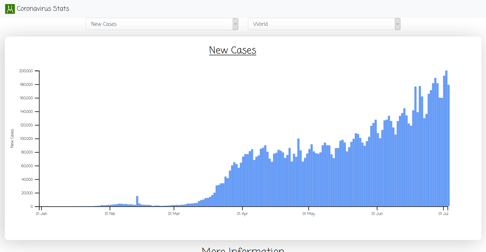
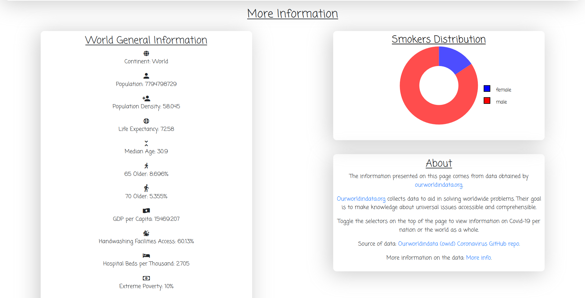

# CORONAVIRUS STATISTICS DASHBOARD
---
## Introduction
---

Last week I set out to create a visual dashboard of Coronavirus statistics. I wanted to create a simple dashboard where a user can view statistics about every country in relation to the current on going coronavirus pandemic. This repository contains code used to generate the dashboard.

Having recently learned d3.js, I put my newly acquired skills to the test.

The dashboard consists of four (4) displays:

1. Bar graph – Displays various statistics against time. These various statisticcs are: new cases(cases per day), new deaths(deaths per day), new tests(tests per day), total cases(cumulative cases), total tests(cumulative tests) and total deaths(cumulative deaths).

2. General Information – Displays general statistics about a country such as median age, population, diabetes prevalence, percentage of people 65 years and older, etc.

3. Donut graph – Displays the smokers’ distribution according to gender in the selected country.

4. About – Contains short paragraphs explaining the sources of data and how to use the dashboard.

## Screenshots
---

## Website
---
View at: [coronavirus.hmwawuda.com](https://coronavirus.hmwawuda.com)

