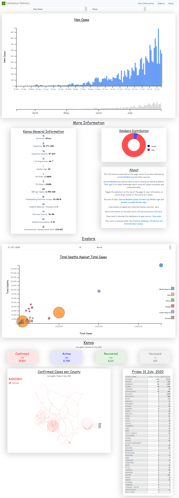

# CORONAVIRUS STATISTICS DASHBOARD

## Introduction

Using D3.js I was able to create a dashboard to visual data in relation the the covid-19 pandemic.

The dashboard consists of the follwing displays/sections:

1. Bar graph – Displays various statistics against time. These various statisticcs are: new cases(cases per day), new deaths(deaths per day), new tests(tests per day), total cases(cumulative cases), total tests(cumulative tests) and total deaths(cumulative deaths).

2. General Information – Displays general statistics about a country such as median age, population, diabetes prevalence, percentage of people 65 years and older, etc.

3. Donut graph – Displays the smokers’ distribution according to gender in the selected country.

4. Scatter Plot - A scatter plot of total deaths against total cases in different countries. You can view how different countries have been affected by the covid-19 pandemic. You can also use the selectors to toggle the continents and dates you wish to view.

5. Kenya section - A section to show you the spread of the virus within Kenya.

6. About – Contains short paragraphs explaining the sources of data and how to use the dashboard.

## Screenshot

## Website

View at: [coronavirus.hmwawuda.com](https://coronavirus.hmwawuda.com)

## License

Shield: [![CC BY 4.0][cc-by-shield]][cc-by]

This work is licensed under a
[Creative Commons Attribution 4.0 International License][cc-by].

[![CC BY 4.0][cc-by-image]][cc-by]

[cc-by]: http://creativecommons.org/licenses/by/4.0/
[cc-by-image]: https://i.creativecommons.org/l/by/4.0/88x31.png
[cc-by-shield]: https://img.shields.io/badge/License-CC%20BY%204.0-lightgrey.svg